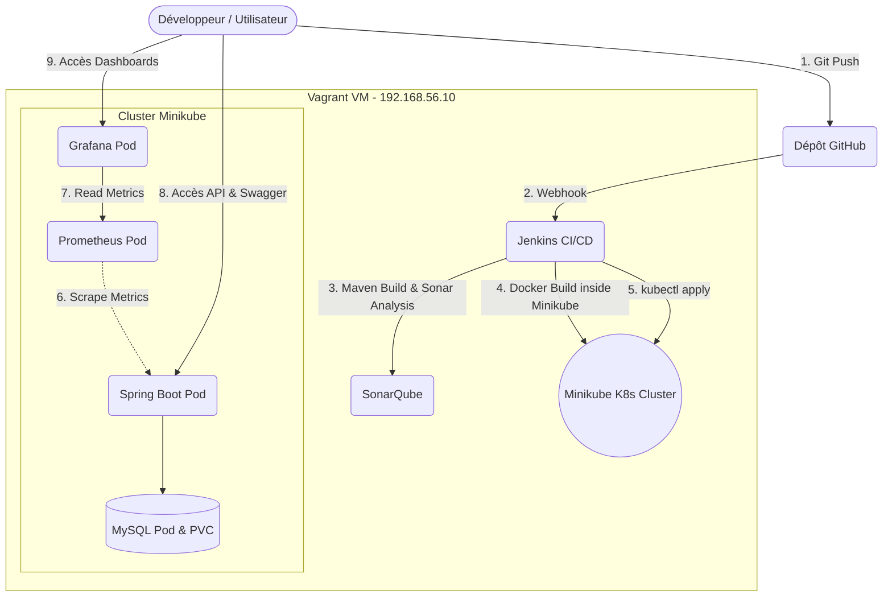

# 🎓 Student Management System


-----------------------------------
Bienvenue sur le projet **Student Management**, une application robuste développée avec **Spring Boot (Java 25 LTS)**, intégrant un environnement de développement et de déploiement DevOps complet.

---

## 🚀 Architecture et Fonctionnement du Projet

L'infrastructure du projet est entièrement conteneurisée et automatisée. Le pipeline CI/CD déploie l'application directement dans un cluster Kubernetes local (Minikube) situé à l'intérieur de la machine virtuelle Vagrant.



---

## 🚀 Fonctionnalités Principales
- Gestion des **Étudiants** (Création, lecture, mise à jour, suppression).
- Gestion des **Départements**.
- Gestion des **Inscriptions (Enrollments)** aux différents cours.
- API REST documentée interactivement avec **Swagger UI**.

---

## 🛠️ Stack Technique
- **Langage** : Java 25 LTS
- **Framework** : Spring Boot
- **Base de données** : MySQL 8.0
- **DevOps** :
  - **CI/CD** : Jenkins (Pipeline as Code via `Jenkinsfile`)
  - **Orchestration** : Kubernetes (Minikube local)
  - **Analyse de Qualité** : SonarQube avec couverture JaCoCo
  - **Monitoring** : Prometheus & Grafana
  - **Environnement Virtuel** : Vagrant (Ubuntu 22.04 LTS)

---

## ⚙️ Démarrage Rapide

### Option 1 : Déploiement Complet K8s & CI/CD (Recommandé)
1. Démarrez la machine virtuelle Vagrant :
```bash
vagrant up
vagrant ssh
```
2. Installez Minikube et Kubectl via le script automatisé :
```bash
cd /vagrant
./scripts/install-k8s.sh
```
3. Poussez votre code sur GitHub pour déclencher le pipeline Jenkins (ou lancez le build manuellement). Jenkins se chargera de builder, analyser, conteneuriser et déployer l'application sur le cluster Kubernetes local.

### Option 2 : Démarrage Natif de Secours
Si vous ne souhaitez pas utiliser Kubernetes, vous pouvez utiliser notre gestionnaire bash local. Notez que l'application est prioritairement conçue pour être gérée par K8s.
```bash
./scripts/manage-app.sh start
./scripts/manage-app.sh stop
./scripts/manage-app.sh status
./scripts/manage-app.sh clean
```

---

## 📊 URLs de l'Environnement (Vagrant)

| Service | URL | Identifiants par défaut |
|---|---|---|
| **Spring Boot API (via K8s)** | `minikube service spring-service -n devops-tools --url` | N/A |
| **Swagger UI (Documentation)** | `[URL_SPRING_BOOT]/swagger-ui.html` | N/A |
| **Jenkins** | `http://192.168.56.10:8080` | Voir logs Vagrant |
| **SonarQube** | `http://192.168.56.10:9000` | `admin` / `admin` |
| **Grafana** | `http://192.168.56.10:30300` (NodePort K8s) | `admin` / `admin` |
| **Prometheus** | `http://192.168.56.10:30090` (NodePort K8s) | N/A |

---

## 📁 Architecture du Dépôt
- `src/` : Code source Java.
- `docker/` : Dockerfiles, configuration Compose (infra monitoring & CI).
- `k8s/` : Manifestes de déploiement Kubernetes (Deployments, Services, PVC).
- `scripts/` : Scripts bash d'utilitaires :
  - `install-k8s.sh` : Installe et configure Minikube pour Jenkins.
  - `k8s-expose.sh` : Expose automatiquement un service K8s sur le premier port libre.
  - `manage-app.sh` : Gestionnaire local de secours de l'application Spring Boot.
- `Jenkinsfile` : Pipeline CI/CD automatisé de bout en bout.
- `Vagrantfile` : Infrastructure as Code de l'environnement de développement.
