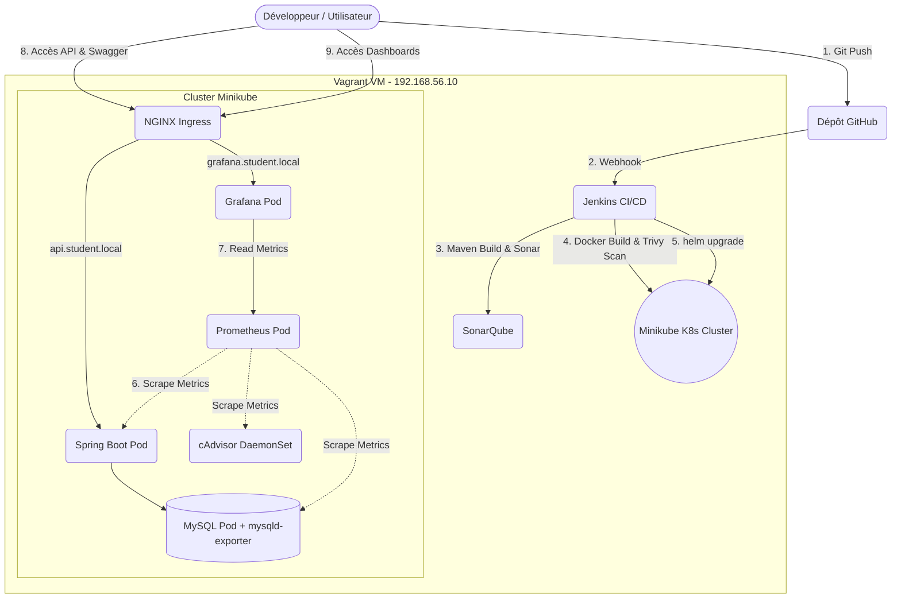

# 🎓 Student Management System


-----------------------------------
Bienvenue sur le projet **Student Management**, une application robuste développée avec **Spring Boot (Java 25 LTS)**, intégrant un environnement de développement et de déploiement DevOps complet.

---

## 🚀 Architecture et Fonctionnement du Projet

L'infrastructure du projet est entièrement conteneurisée et automatisée. Le pipeline CI/CD déploie l'application directement dans un cluster Kubernetes local (Minikube) situé à l'intérieur de la machine virtuelle Vagrant.



---

## 🚀 Fonctionnalités Principales
- Gestion des **Étudiants** (Création, lecture, mise à jour, suppression).
- Gestion des **Départements**.
- Gestion des **Inscriptions (Enrollments)** aux différents cours.
- API REST documentée interactivement avec **Swagger UI**.

---

## 🛠️ Stack Technique
- **Langage** : Java 25 LTS
- **Framework** : Spring Boot
- **Base de données** : MySQL 8.0
- **DevOps & SecOps** :
  - **CI/CD** : Jenkins (Pipeline as Code)
  - **Orchestration** : Kubernetes (Minikube) & Helm (Package Manager)
  - **Ingress Routing** : NGINX Ingress Controller
  - **Qualité & Sécurité** : SonarQube (SAST), Trivy (Container Scanning)
  - **Monitoring** : Prometheus & Grafana (avec cAdvisor & mysqld-exporter)
  - **Environnement Virtuel** : Vagrant (Ubuntu 22.04 LTS)

---

## ⚙️ Guide Complet de A à Z (De Vagrant jusqu'aux Dashboards)

Voici la procédure intégrale pour lancer, configurer et utiliser le projet depuis zéro :

### Étape 1 : Démarrage de l'infrastructure virtuelle
Ouvrez un terminal (Git Bash, PowerShell) sur votre machine physique Windows, placez-vous dans le dossier du projet et lancez Vagrant :
```bash
vagrant up
vagrant ssh
```

### Étape 2 : Préparation de l'environnement K8s (1ère fois uniquement)
Une fois connecté en SSH sur la machine virtuelle (`vagrant@...`), installez les outils cloud-native :
```bash
cd /vagrant
# Installation de K8s (Minikube), Helm, Nginx Ingress et démarrage de Jenkins
./scripts/install-k8s.sh
```

### Étape 3 : Configuration DNS sur Windows (Obligatoire)
Pour que l'Ingress Kubernetes puisse router le trafic grâce aux URLs élégantes, vous devez indiquer à Windows que ces domaines pointent vers l'IP de Vagrant.
1. Ouvrez le **Bloc-notes en tant qu'Administrateur** sur Windows.
2. Ouvrez le fichier : `C:\Windows\System32\drivers\etc\hosts`
3. Ajoutez cette ligne tout à la fin du fichier, puis sauvegardez :
   `192.168.56.10 api.student.local grafana.student.local`

### Étape 4 : Déploiement Automatisé via Jenkins (CI/CD)
1. Tout changement poussé sur GitHub (`git push`) déclenchera automatiquement le pipeline.
2. (Optionnel) Ouvrez **Jenkins** (`http://192.168.56.10:8080`), et lancez manuellement un "Build Now" sur le job `student-management-pipeline`.
3. Jenkins va : Compiler le code Java, analyser la qualité (SonarQube), créer l'image Docker, vérifier les failles de sécurité (Trivy), et déployer l'architecture de Microservices et de Monitoring sur Kubernetes via Helm.

### Étape 5 : Ouverture du Routeur (Tunnel Ingress)
Une fois le déploiement K8s terminé (build Jenkins vert), vous devez ouvrir le port K8s.
Dans votre terminal Vagrant, exécutez le script intelligent :
```bash
./scripts/ingress-tunnel.sh
```
*(⚠️ Gardez impérativement ce terminal ouvert en arrière-plan)*

### Étape 6 : Accès et Magie "1-clic"
Sur votre ordinateur Windows, naviguez dans l'explorateur de fichiers jusqu'au dossier du projet `scripts/`, et double-cliquez sur le fichier **`open-dashboards.bat`**.
Votre navigateur web s'ouvrira instantanément avec 5 onglets :
- **Swagger** (Test interactif de l'API).
- **Grafana** (Dashboards auto-peuplés du CPU, RAM, JVM et MySQL).
- **Jenkins**, **SonarQube** et **Prometheus**.

*(Si vous souhaitez lancer l'application en mode secours sans Kubernetes, utilisez le script `./scripts/manage-app.sh start`).*

---

## 📊 URLs de l'Environnement (Vagrant)

| Service | URL | Identifiants par défaut |
|---|---|---|
| **Spring Boot API** | `http://api.student.local` (via Ingress) | N/A |
| **Swagger UI** | `http://api.student.local/student/swagger-ui.html` | N/A |
| **Jenkins** | `http://192.168.56.10:8080` | Voir logs Vagrant |
| **SonarQube** | `http://192.168.56.10:9000` | `admin` / `admin` |
| **Grafana** | `http://grafana.student.local` (via Ingress) | `admin` / `admin` |
| **Prometheus** | `http://192.168.56.10:30090` (NodePort K8s) | N/A |

---

## 📁 Architecture du Dépôt
- `src/` : Code source Java.
- `docker/` : Dockerfiles, configuration Compose (infra monitoring & CI).
- `helm/student-management/` : Chart Helm contenant toute l'infrastructure dynamique (Deployments, Services, Ingress, PVC, ConfigMaps).
- `scripts/` : Scripts bash & Windows d'utilitaires :
  - `install-k8s.sh` : Installe et configure Minikube pour Jenkins.
  - `ingress-tunnel.sh` : Ouvre automatiquement le tunnel Ingress sur K8s vers le port 80.
  - `open-dashboards.bat` : Script Windows (double-clic) pour ouvrir tous les URLs du projet dans le navigateur.
  - `k8s-expose.sh` : Expose manuellement un service K8s sur un port libre.
  - `manage-app.sh` : Gestionnaire local de secours de l'application Spring Boot.
- `Jenkinsfile` : Pipeline CI/CD automatisé de bout en bout.
- `Vagrantfile` : Infrastructure as Code de l'environnement de développement.
