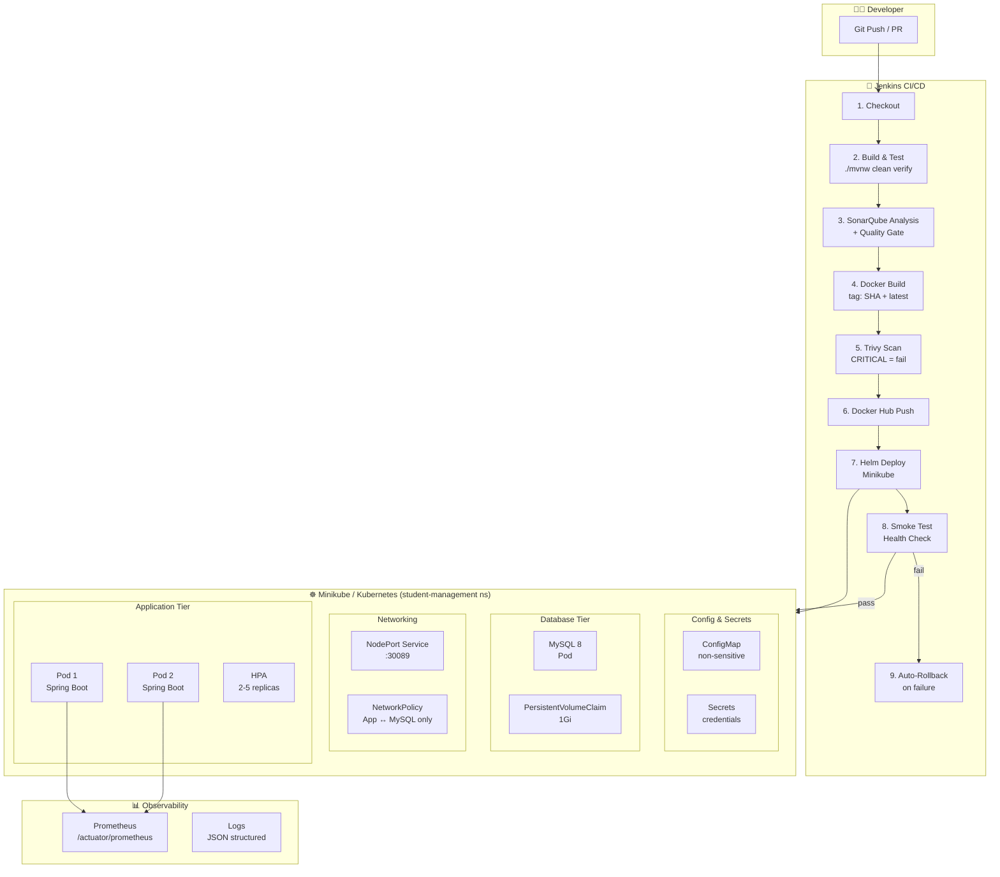

<div align="center">
  <h1>🎓 Student Management System — DevOps Stack</h1>
  <p>
    <b>Production-ready Spring Boot 3 / Java 21 / MySQL 8 application</b><br>
    <i>Complete with CI/CD pipeline, Kubernetes Helm deployment, security scanning, and observability.</i>
  </p>

  <!-- Badges -->
  <p>
    <a href="https://spring.io/projects/spring-boot"></a>
    <a href="https://java.com"></a>
    <a href="https://www.mysql.com/"></a>
    <br>
    <a href="https://jenkins.io"></a>
    <a href="https://hub.docker.com/r/walid369/student-management"></a>
    <a href="https://kubernetes.io/"></a>
    <br>
    <a href="http://localhost:9000"></a>
    <a href="https://trivy.dev/"></a>
  </p>
</div>

---

## 🏛️ Architecture



---

## 📋 Prerequisites

| Tool | Version | Purpose |
|---|---|---|
| **Java (JDK)** | 21 | Build & run |
| **Maven** | 3.9+ | Build tool |
| **Docker** | 24+ | Containerization |
| **kubectl** | 1.28+ | K8s CLI |
| **Helm** | 3.12+ | K8s package manager |
| **Minikube** | 1.32+ | Local K8s cluster |
| **Trivy** | 0.48+ | Security scanner |
| **Jenkins** | 2.440+ | CI/CD |
| **SonarQube** | 10.x | Code quality |

---

## 🚀 Quick Start (Local Dev)

### 1. Clone & Build
**Unix/Linux (using Makefile):**
```bash
git clone https://github.com/WalidBenTouhami/student-management.git
cd student-management

# Build & Run tests
make build
make test
```

**Windows / Standard CLI:**
```powershell
git clone https://github.com/WalidBenTouhami/student-management.git
cd student-management

# Build Maven project
.\mvnw.cmd clean package -DskipTests

# Run tests & verify coverage
.\mvnw.cmd clean verify
```

### 2. Run with Docker Compose
**Unix/Linux:**
```bash
cp .env.example .env   # edit values
make docker-run
```

**Windows / Standard CLI:**
```powershell
copy .env.example .env   # edit values
docker compose up -d
```
* **App URL**: http://localhost:8089/student
* **Swagger Documentation**: http://localhost:8089/student/swagger-ui.html

### 3. Build & Push Docker Image
**Unix/Linux:**
```bash
# Build image (auto-tags with git SHA)
make docker-build

# Push to Docker Hub (requires docker login)
docker login
make docker-push
```

**Windows / Standard CLI:**
```powershell
# Build image
docker build -t walid369/student-management:latest .

# Push to Docker Hub
docker login
docker push walid369/student-management:latest
```

---

## ☸️ Kubernetes Deployment (Minikube)

### 1. Start Minikube
```bash
minikube start --cpus=4 --memory=4096 --driver=docker
minikube addons enable metrics-server
minikube addons enable ingress    # optional
```

### 2. Deploy via Helm
**Unix/Linux:**
```bash
# Lint & dry-run
make helm-lint
make helm-dry-run

# Set your credentials
export MYSQL_ROOT_PASSWORD="***"
export MYSQL_APP_USER="student_user"
export MYSQL_APP_PASSWORD="***"
export ACTUATOR_USER="actuator-admin"
export ACTUATOR_PASSWORD="***"
export API_USER="api-user"
export API_PASSWORD="***"

# Deploy
make k8s-deploy IMAGE_TAG=$(git rev-parse --short HEAD)
```

**Windows / Standard CLI:**
```powershell
# Lint chart
helm lint ./helm/student-management

# Dry-run
helm install student-management ./helm/student-management --dry-run --debug

# Set your credentials (PowerShell environment variables)
$env:MYSQL_ROOT_PASSWORD="***"
$env:MYSQL_APP_USER="student_user"
$env:MYSQL_APP_PASSWORD="***"
$env:ACTUATOR_USER="actuator-admin"
$env:ACTUATOR_PASSWORD="***"
$env:API_USER="api-user"
$env:API_PASSWORD="***"

# Deploy via Helm upgrade
helm upgrade --install student-management ./helm/student-management `
  --namespace student-management `
  --create-namespace `
  --set image.tag="latest" `
  --set mysqlSecret.rootPassword="$env:MYSQL_ROOT_PASSWORD" `
  --set mysqlSecret.appUser="$env:MYSQL_APP_USER" `
  --set mysqlSecret.appPassword="$env:MYSQL_APP_PASSWORD" `
  --set appSecret.actuatorUser="$env:ACTUATOR_USER" `
  --set appSecret.actuatorPassword="$env:ACTUATOR_PASSWORD" `
  --set appSecret.apiUser="$env:API_USER" `
  --set appSecret.apiPassword="$env:API_PASSWORD" `
  --atomic `
  --timeout 5m
```

### 3. Access the Application
```bash
# Get Minikube IP
export MINIKUBE_IP=$(minikube ip)

# Application
curl http://$MINIKUBE_IP:30089/student/actuator/health

# Prometheus metrics
curl http://$MINIKUBE_IP:30089/student/actuator/prometheus
```

### 4. Check Status
**Unix/Linux:**
```bash
make k8s-status
```

**Windows / Cross-platform CLI:**
```powershell
kubectl get pods,hpa,pdb,svc,netpol -n student-management
```

---

## 🔧 Jenkins Pipeline Setup

### Required Jenkins Credentials

Configure these in **Jenkins → Manage Jenkins → Credentials → System → Global**:

| ID | Type | Description |
|---|---|---|
| `github-token` | Username/Password | GitHub PAT for checkout |
| `docker-hub-credentials` | Username/Password | Docker Hub login |
| `Sonar_token` | Secret text | SonarQube API token |
| `kubeconfig-minikube` | Secret file | `~/.kube/config` from Minikube host |
| `mysql-root-credentials` | Username/Password | MySQL root user |
| `mysql-app-credentials` | Username/Password | MySQL app user |
| `actuator-credentials` | Username/Password | Spring Actuator basic auth |
| `api-credentials` | Username/Password | API basic auth |

### Required Jenkins Plugins

```text
git, pipeline, sonarqube-scanner, docker-pipeline, 
jacoco, html-publisher, credentials-binding
```

### Pipeline Stages

| Stage | Description | Fails on |
|---|---|---|
| **Checkout** | Git clone with credentials | Invalid repo/credentials |
| **Build & Test** | `mvnw clean verify` + JaCoCo | Test failure / coverage < 80% |
| **SonarQube Analysis**| `mvn sonar:sonar` | SonarQube unreachable |
| **Quality Gate** | Wait for SonarQube result | Quality Gate status != OK |
| **Build Docker** | Multi-stage build with OCI labels| Build error |
| **Trivy Scan** | CVE scan, fail on CRITICAL | Any CRITICAL CVE |
| **Push to Docker Hub**| Push `:sha` + `:latest` | Auth failure |
| **Deploy to K8s** | `helm upgrade --install --atomic`| Helm failure / timeout |
| **Smoke Test** | Health check + pod count | App not healthy / rollback |

---

## 🔒 Security (DevSecOps)

| Control | Implementation |
|---|---|
| **Zero hardcoded secrets** | All secrets injected via Jenkins Credentials → K8s Secrets |
| **Alpine Base Image** | Uses `eclipse-temurin:21-jre-alpine` |
| **Non-root container** | Run as `appuser` (UID custom), no privilege escalation |
| **CVE Scanning** | Trivy on every build (CRITICAL = pipeline fail) |
| **Pod Security Standards** | `restricted` profile on namespace |
| **NetworkPolicy** | MySQL accessible only from app pods |
| **seccompProfile** | `RuntimeDefault` on all pods |
| **Capabilities dropped** | `ALL` Linux capabilities dropped |
| **Dependency updates** | Dependabot configured (weekly Maven + Docker updates) |

---

## 📊 Observability

### Prometheus Metrics
- **Endpoint**: `GET /student/actuator/prometheus`
- **Tags**: `application=student-management`
- **Discovery**: Annotations on pods for auto-discovery by Prometheus Operator.

### Health Endpoints
```bash
# Liveness (K8s probe)
GET /student/actuator/health/liveness

# Readiness (K8s probe)  
GET /student/actuator/health/readiness

# Full health (requires actuator credentials)
GET /student/actuator/health
```

### Structured JSON Logging
```json
{
  "timestamp": "2025-01-01T12:00:00Z",
  "level": "INFO",
  "logger": "tn.esprit.studentmanagement.service.StudentService",
  "message": "Student created",
  "thread": "http-nio-8089-exec-1"
}
```

---

## 🛠️ Make Targets Reference

```bash
make help           # Show all available targets
make build          # Maven build (skip tests)
make test           # Run tests + JaCoCo coverage
make sonar          # SonarQube analysis
make deps-check     # Check outdated dependencies
make docker-build   # Build Docker image
make docker-push    # Push to Docker Hub
make trivy-scan     # Security scan with Trivy
make helm-lint      # Lint Helm chart
make helm-dry-run   # Dry-run K8s deployment
make k8s-deploy     # Deploy to Kubernetes
make k8s-status     # Show K8s resource status
make k8s-logs       # Follow app logs
make k8s-rollback   # Rollback Helm release
make health         # Check app health endpoint
make clean          # Clean build + Docker
```

---

## 📁 Project Structure

```text
student-management/
├── src/                              # Java source code
│   ├── main/java/                    # Application code
│   └── main/resources/
│       ├── application.properties    # Base config
│       ├── application-prod.yml      # Prod config
│       └── application-test.yml      # Test profile
├── Dockerfile                        # Multi-stage, distroless
├── Jenkinsfile                       # 9-stage CI/CD pipeline
├── Makefile                          # Reproducible commands
├── docker-compose.yml                # Local dev stack
├── sonar-project.properties          # SonarQube config
├── helm/student-management/          # Helm chart
│   ├── Chart.yaml
│   ├── values.yaml
│   ├── values-prod.yaml
│   └── templates/
│       ├── deployment.yaml
│       ├── service.yaml
│       ├── configmap.yaml
│       ├── secret.yaml
│       ├── hpa.yaml
│       ├── networkpolicy.yaml
│       ├── ingress.yaml
│       ├── pdb.yaml                  # PodDisruptionBudget for High Availability
│       ├── mysql-deployment.yaml
│       ├── mysql-pvc.yaml
│       └── NOTES.txt
└── docs/                             # Technical documentation
    ├── architecture.md
    ├── jenkins-setup.md
    ├── kubernetes-setup.md
    ├── security.md
    └── advanced-setup.md
```

---

## 🔁 Rollback

**Unix/Linux:**
```bash
make k8s-rollback
```

**Cross-platform / Helm directly:**
```bash
# Rollback to the previous version
helm rollback student-management -n student-management --wait

# View revision history
helm history student-management -n student-management
```

---

## 📈 Audit & New Features (DevOps Master-grade)

- **Student Filtering & Search**: `GET /student/api/students/search` with parameters `name`, `email`, `departmentName`, `departmentId`, `page`, `size` (paginated and filtered dynamic lookup).
- **Course Assignment**: `PUT /student/api/courses/{id}/assign/{departmentId}` to link a course to a department.
- **Analytics Dashboard**:
  - `GET /student/api/stats/dashboard`: Exposes total count of students, courses, departments, enrollments, average grade, status distributions, and enrollment metrics.
  - `GET /student/api/stats/report`: Dynamic tabular report grouping active/total enrollments and average grade by department name and course code.
- **PodDisruptionBudget (PDB)**: Added template `helm/student-management/templates/pdb.yaml` to prevent cluster disruption during node operations by ensuring at least 1 replica is active.
- **Harden Validation & Business Rules**:
  - Validates student age to be at least 18 years on register/update.
  - Verifies unique email constraint before database persist.
  - Enforces course capacity checks during student enrollment (status ACTIVE).
  - Protects against duplicate ACTIVE student enrollment in the same course.
- **Code Quality**: Enforced minimum JaCoCo instruction coverage of **80%** in the Maven build.

---

## 📚 Documentation

- [Architecture Details](docs/architecture.md)
- [Jenkins Setup Guide](docs/jenkins-setup.md)
- [Kubernetes Setup Guide](docs/kubernetes-setup.md)
- [Security Decisions](docs/security.md)

## 🚀 Advanced DevOps Setup

See [docs/advanced-setup.md](docs/advanced-setup.md) for instructions on Ingress, Autoscaling (HPA), Monitoring (Prometheus, Grafana, Loki), and GitOps (ArgoCD).